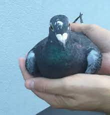

# ptoszek.pl - Sptoszkuj kogoś!



### Czym jest ptoszek.pl?
Ptoszek.pl to projekt edukacyjny mający na celu uświadamianie użytkowników internetu o zagrożeniach związanych z otwieraniem nieznanych linków. Strona demonstruje potencjalne możliwości stron internetowych uruchamianych w przeglądarce, takie jak nietypowe interakcje czy nieoczekiwane działania.

**Uwaga:**  
Strona jest w pełni bezpieczna. Nie powoduje żadnych szkód ani zagrożeń dla Twojego urządzenia. Wszystkie funkcje mają charakter edukacyjny, a pobierane pliki (zdjęcia, filmy) są wolne od wirusów.

---

## Jak możesz pomóc w rozwoju projektu?

Ptoszek.pl to projekt open-source i każdy może wnieść swój wkład!  

- Dodaj nowe funkcje, np. kolejne nietypowe interakcje w przeglądarce.  
- Rozszerz stronę o nowe mechanizmy (np. obsługę kolejnych nietypowych zachowań).  
- Zgłoś swoje pomysły w postaci **Pull Requesta** – chętnie je dodam!

---

## Jak zacząć?

1. Sklonuj repozytorium:  
   ```bash
   git clone https://github.com/jaczup/ptoszek.pl.git
   cd ptoszek
   ```
2. Otwórz projekt w swoim ulubionym edytorze kodu.  
3. Wprowadź zmiany i przetestuj je lokalnie.  
4. Zgłoś Pull Requesta!

---

## Inspiracja

Projekt został stworzony przez [jaczup.pl](https://jaczup.pl) na bazie popularnej strony [theannoyingsite.com](https://theannoyingsite.com), znanej za granicą.

---

## Historia

Pewnego dnia, chcąc strollować moich znajomych, stworzyłem stronę sapcord.pl/ptoszek. Była to przerobiona kopia theannoyingsite.com, gdzie zamiast kotów umieściłem zdjęcia ptaków i dostosowałem kod strony, dodając elementy związane ze mną. Strona zaczęła żyć własnym życiem, gdy znajomi zaczęli rozsyłać do niej linki, co stało się pierwszą formą jej promocji. Wkrótce powstał pierwszy TikTok o Ptoszku, na którym strona została otwarta podczas lekcji informatyki (przez Hedwisa - dawny znajomy [kto wie, ten wie :)]). Był to rok 2021 / 2022. Popularność zaczęła rosnąć.

Rosnący ruch na stronie skłonił mnie do zakupu osobnej domeny – ptoszek.pl – na której strona działa do dziś. Wraz z nową domeną jej popularność eksplodowała, a użytkownicy masowo pokazywali ją na TikToku. Twórcy, tacy jak MokrySuchar i Dawid Jasper (i zapewne też parenastu innych o których nie wiem), zostali strollowani przez swoich widzów, którzy podsyłali im linki do strony. Ptoszek.pl pojawił się nawet w filmie testującym "wirusy" autorstwa mlodziutki7, oczywiście Ptoszek.pl z wirusem nie ma nic wspólnego.

Powstały również forki Ptoszka, które w interesujący sposób starają się zwrócić uwagę na zagrożenia w internecie. Cieszy mnie, że są osoby, które chcą tworzyć własne wersje projektu. Nie wiem jednak, czy ich celem było jedynie chwilowe trollowanie, czy faktyczna edukacja. Sam początkowo traktowałem Ptoszka jako żart, ale gdy strona zaczęła zdobywać popularność, zmieniłem swoje podejście i zacząłem rozwijać ją z myślą o przestrodze o niebezpieczeństwie stron w internecie.

Obecnie projekt jest otwarty na Pull Requesty od innych osób, co stanowi świetną okazję, by zostać upamiętnionym w kodzie strony – każdy, kto wniesie ciekawą propozycję, może zostać dodany w postaci komentarza w kodzie, który zaproponował. 

Niestety, pojawiły się również niezbyt zadowolające mnie kopie, które faktycznie były zawirusowane, ale na szczęście większość z nich już nie działa.
Obecnie strona generuje około **2,5 tys. odwiedzin dziennie**, a w trakcie walk freakfightowych liczba ta wzrasta nawet do **10 tys. odwiedzin**, gdy ludzie rozsyłają linki do strony jako rzekome "nielegalne restreamy" transmisji.

Nigdy nie przypuszczałem, że mój chwilowy troll na znajomych zyska tak ogromny rozgłos, a Ptoszek.pl stanie się tak rozpoznawalny. Co ciekawe, wiele osób wciąż zastanawia się, czy strona jest wirusem, IP-stealerem lub czymś podobnym. Odpowiedź jest prosta: nie, i nigdy taką formą nie będzie / nie był.
Musiałem jednak zmierzyć się z licznymi zgłoszeniami – zarówno do Cloudflare, gdzie opierałem zabezpieczenia strony, jak i do CERT, który po moim odwołaniu przywrócił stronę do działania. Niestety, niektórzy nadal uparcie wierzą w fałszywe teorie o tym, że strona jest zawirusowana.

Mimo to, będę nieustannie dbał o to, by strona była dostępna i mogła edukować użytkowników, ostrzegając ich przed realnymi zagrożeniami w internecie.

---

**Zostań częścią projektu i pomóż przestrzegać innych o niebezpieczeństwie w internecie!** 🚀
